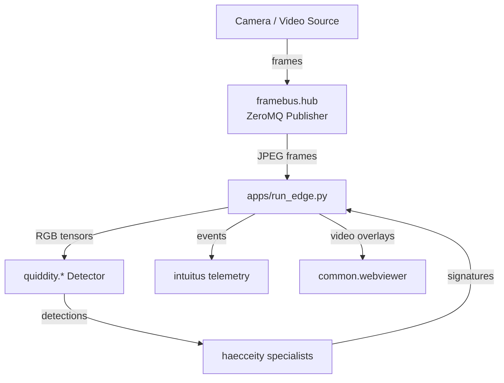

# Scotty Architecture

Scotty is an edge-friendly perception stack that streams frames from embedded
hardware, detects objects, and enriches the resulting observations with
appearance signatures. The platform is composed of loosely coupled modules that
communicate through well-defined interfaces and configuration contracts.

## Component overview

### Frame ingestion (`framebus/`)
The frame bus provides a ZeroMQ hub capable of reading from PiCamera2, video
files, or OpenCV devices. It publishes JPEG-encoded frames plus metadata to
consumers such as `apps/run_edge.py`.

### Edge application (`apps/`)
`apps/run_edge.py` orchestrates the full perception pipeline. It reads frames
from FrameBus or direct sources, loads configured detectors plus haecceity
specialists, and produces annotated frames plus structured events. The script
also manages lifecycle concerns such as graceful shutdown, MQTT publication, and
interactive diagnostics.

### Detection (`quiddity/`)
Detectors implement the inference stage that turns raw frames into bounding
boxes. The loader in `common.loader` instantiates detector classes based on
configuration entries.

### Embedding and identity (`haecceity/`)
Haecceity manages specialists that compute embeddings for detections and merges
fallback models. The specialists are selected per class and can be gated by
quality heuristics such as bounding-box height or sharpness.

### Telemetry (`intuitus/`)
Intuitus modules capture runtime metrics and emit them to observability backends.
The edge app wires the configured telemetry publisher to receive events and
health reports.

### Utilities (`common/` and `docs/`)
Shared utilities cover geometry math, overlay drawing, and video helpers. The
new `tests/` structure separates quick unit tests from media-driven scenarios,
and `docs/` hosts reference material such as this architecture guide.
